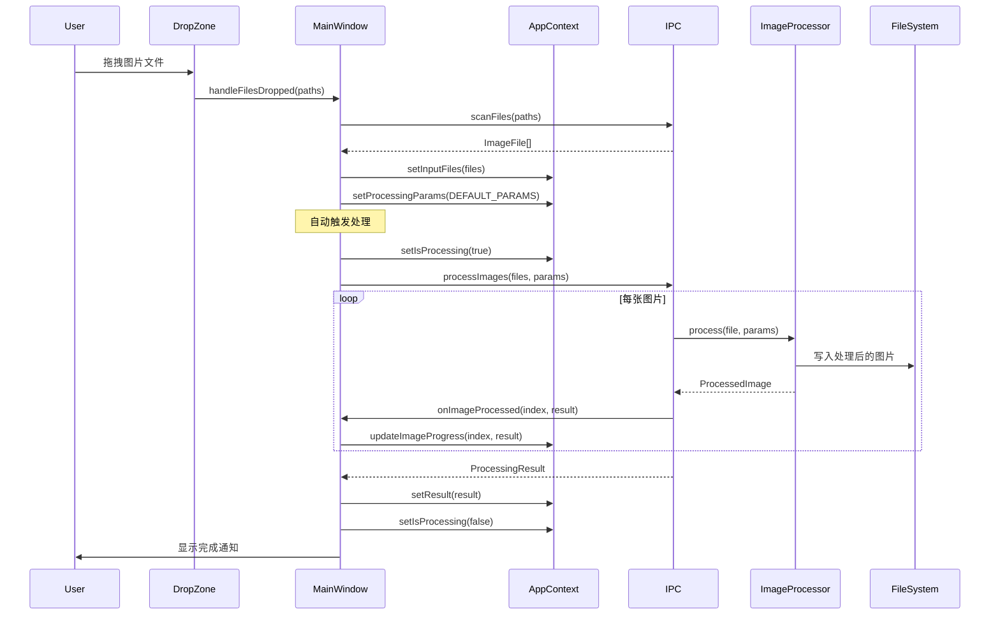
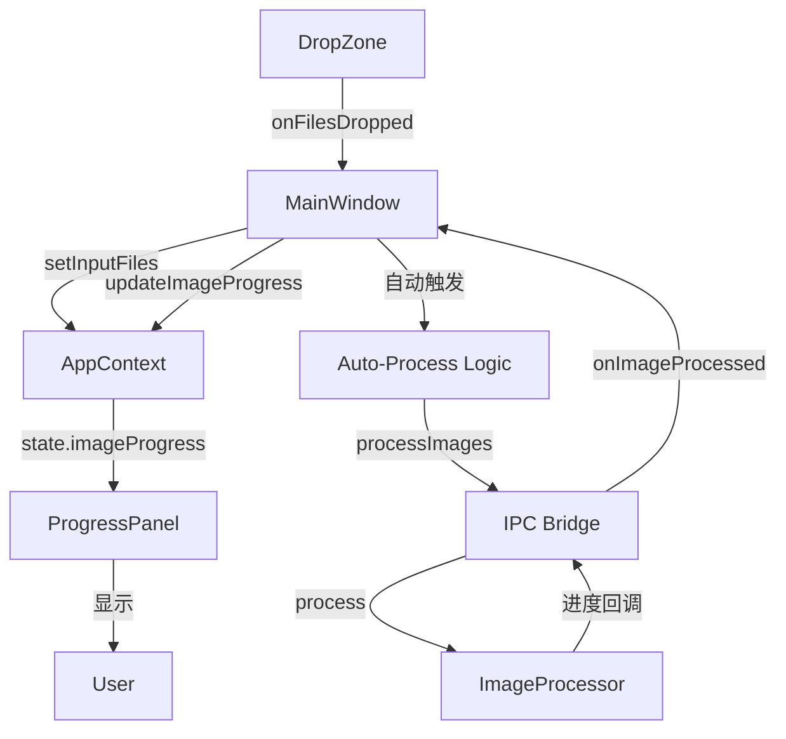
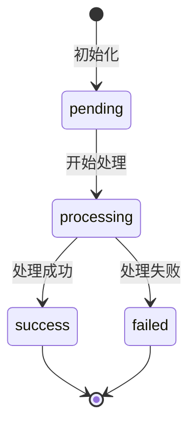

# Design Document: auto-process-on-drop

## Overview

当前 BatchPic 应用的工作流程需要用户手动点击"开始导出图片"按钮来触发图片处理。本功能旨在优化交互流程，实现拖拽图片后立即自动处理，使用预设参数，按图片展示处理进度，全程无需用户干预。

核心改进：
- 拖拽即处理：文件扫描完成后立即触发批量处理
- 预设参数：使用 DEFAULT_PARAMS（质量 70%，保持原始尺寸和格式）
- 实时进度：按图片展示处理进度，而非整体百分比
- 零干预：无需用户点击任何按钮

## Architecture

### High-Level System Flow



### Component Architecture




## Components and Interfaces

### 1. AppContext State Extension

需要扩展 AppContext 以支持按图片的进度跟踪。

**新增状态字段：**

```typescript
interface ImageProgress {
  index: number;
  fileName: string;
  status: 'pending' | 'processing' | 'success' | 'failed';
  progress: number; // 0-100
  error?: string;
  outputPath?: string;
  originalSize?: number;
  processedSize?: number;
}

interface AppState {
  // ... 现有字段
  
  // 新增：按图片的进度跟踪
  imageProgress: ImageProgress[];
  
  // 新增：自动处理开关（用户可选择关闭）
  autoProcessOnDrop: boolean;
}
```

**新增 Context Actions：**

```typescript
interface AppContextValue {
  // ... 现有方法
  
  // 初始化图片进度列表
  initializeImageProgress: (files: ImageFile[]) => void;
  
  // 更新单张图片的进度
  updateImageProgress: (index: number, progress: Partial<ImageProgress>) => void;
  
  // 切换自动处理开关
  setAutoProcessOnDrop: (enabled: boolean) => void;
}
```

### 2. MainWindow Component Modification

**新增自动处理逻辑：**

```typescript
// MainWindow.tsx 中的新增逻辑

const handleFilesDropped = async (paths: string[]) => {
  try {
    // 1. 扫描文件
    const scannedFiles = await window.electronAPI.scanFiles(paths);
    
    // 2. 更新状态
    setInputFiles([...state.inputFiles, ...scannedFiles]);
    setProcessingParams(DEFAULT_PARAMS);
    
    // 3. 初始化进度跟踪
    initializeImageProgress(scannedFiles);
    
    // 4. 显示通知
    showNotification('已为你准备好一个可直接使用的版本', 'success', 3000);
    
    // 5. 自动触发处理（新增）
    if (state.autoProcessOnDrop) {
      await autoProcessImages(scannedFiles);
    }
  } catch (error) {
    console.error('Failed to scan files:', error);
    showNotification('文件扫描失败', 'error', 3000);
  }
};

const autoProcessImages = async (files: ImageFile[]) => {
  try {
    setIsProcessing(true);
    
    // 创建输出目录
    const outputDir = await window.electronAPI.createOutputDirectory(
      files.map(f => f.path)
    );
    setOutputDirectory(outputDir);
    
    // 逐张处理图片，实时更新进度
    const results = await window.electronAPI.processImagesWithProgress(
      files,
      state.processingParams,
      outputDir,
      (index: number, result: ProcessedImage) => {
        updateImageProgress(index, {
          status: result.success ? 'success' : 'failed',
          progress: 100,
          error: result.error,
          outputPath: result.outputPath,
          originalSize: result.originalSize,
          processedSize: result.processedSize
        });
      }
    );
    
    // 更新最终结果
    setResult(results);
    
    // 显示完成通知
    const successCount = results.successful.length;
    const failedCount = results.failed.length;
    showNotification(
      `处理完成：${successCount} 成功，${failedCount} 失败`,
      failedCount > 0 ? 'warning' : 'success',
      5000
    );
    
    // 如果有失败，显示错误报告
    if (failedCount > 0) {
      setShowErrorReport(true);
    }
  } catch (error) {
    console.error('Auto-process failed:', error);
    showNotification(
      `自动处理失败: ${error instanceof Error ? error.message : String(error)}`,
      'error',
      5000
    );
  } finally {
    setIsProcessing(false);
  }
};
```


### 3. IPC Bridge Extension

需要在 preload.ts 和 main.ts 中添加新的 IPC 通道。

**preload.ts 新增接口：**

```typescript
// preload.ts

export interface ElectronAPI {
  // ... 现有方法
  
  // 创建输出目录
  createOutputDirectory: (inputPaths: string[]) => Promise<string>;
  
  // 带进度回调的批量处理
  processImagesWithProgress: (
    files: ImageFile[],
    params: ProcessingParams,
    outputDir: string,
    onImageProcessed: (index: number, result: ProcessedImage) => void
  ) => Promise<ProcessingResult>;
}

// 在 contextBridge.exposeInMainWorld 中注册
contextBridge.exposeInMainWorld('electronAPI', {
  // ... 现有方法
  
  createOutputDirectory: (inputPaths: string[]) => 
    ipcRenderer.invoke('create-output-directory', inputPaths),
  
  processImagesWithProgress: (files, params, outputDir, onImageProcessed) => {
    // 注册进度监听器
    const progressHandler = (event: any, index: number, result: ProcessedImage) => {
      onImageProcessed(index, result);
    };
    ipcRenderer.on('image-processed', progressHandler);
    
    // 发起处理请求
    const resultPromise = ipcRenderer.invoke(
      'process-images-with-progress',
      files,
      params,
      outputDir
    );
    
    // 清理监听器
    resultPromise.finally(() => {
      ipcRenderer.removeListener('image-processed', progressHandler);
    });
    
    return resultPromise;
  }
});
```

**main.ts 新增 IPC 处理器：**

```typescript
// main.ts

import { OutputManager } from './OutputManager';
import { ImageProcessor } from './ImageProcessor';

const outputManager = new OutputManager();
const imageProcessor = new ImageProcessor();

// 创建输出目录
ipcMain.handle('create-output-directory', async (event, inputPaths: string[]) => {
  try {
    const outputDir = await outputManager.createOutputDirectory(inputPaths);
    return outputDir;
  } catch (error) {
    console.error('Failed to create output directory:', error);
    throw error;
  }
});

// 带进度回调的批量处理
ipcMain.handle(
  'process-images-with-progress',
  async (event, files: ImageFile[], params: ProcessingParams, outputDir: string) => {
    try {
      const result = await imageProcessor.processBatch(
        files,
        params,
        outputDir,
        (currentIndex: number, total: number, processedImage: ProcessedImage) => {
          // 发送单张图片处理完成事件
          event.sender.send('image-processed', currentIndex, processedImage);
        }
      );
      
      return result;
    } catch (error) {
      console.error('Failed to process images:', error);
      throw error;
    }
  }
);
```

### 4. ImageProcessor Modification

需要修改 `processBatch` 方法以支持更细粒度的进度回调。

**修改后的 processBatch 签名：**

```typescript
// ImageProcessor.ts

export type ImageProgressCallback = (
  currentIndex: number,
  total: number,
  processedImage: ProcessedImage
) => void;

class SharpImageProcessor implements ImageProcessor {
  async processBatch(
    inputs: ImageFile[],
    params: ProcessingParams,
    outputRoot: string,
    onProgress?: ImageProgressCallback
  ): Promise<ProcessingResult> {
    const startTime = Date.now();
    const successful: ProcessedImage[] = [];
    const failed: ProcessedImage[] = [];
    
    for (let i = 0; i < inputs.length; i++) {
      const input = inputs[i];
      
      try {
        // 计算输出路径
        const outputPath = this.getOutputPath(input, outputRoot, params.format || input.format);
        
        // 处理单张图片
        const result = await this.process(input, params, outputPath);
        
        if (result.success) {
          successful.push(result);
        } else {
          failed.push(result);
        }
        
        // 调用进度回调
        if (onProgress) {
          onProgress(i, inputs.length, result);
        }
      } catch (error) {
        const failedResult: ProcessedImage = {
          outputPath: '',
          originalSize: input.size,
          processedSize: 0,
          success: false,
          error: error instanceof Error ? error.message : String(error)
        };
        failed.push(failedResult);
        
        // 调用进度回调（失败情况）
        if (onProgress) {
          onProgress(i, inputs.length, failedResult);
        }
      }
    }
    
    const totalTime = Date.now() - startTime;
    
    return {
      successful,
      failed,
      totalTime
    };
  }
}
```


### 5. ProgressPanel Component (New)

新增一个专门的进度面板组件，用于显示每张图片的处理状态。

**组件接口：**

```typescript
// ProgressPanel.tsx

interface ProgressPanelProps {
  imageProgress: ImageProgress[];
  isProcessing: boolean;
}

export function ProgressPanel({ imageProgress, isProcessing }: ProgressPanelProps) {
  if (imageProgress.length === 0) {
    return null;
  }

  const totalCount = imageProgress.length;
  const completedCount = imageProgress.filter(
    p => p.status === 'success' || p.status === 'failed'
  ).length;
  const successCount = imageProgress.filter(p => p.status === 'success').length;
  const failedCount = imageProgress.filter(p => p.status === 'failed').length;

  return (
    <div className="progress-panel">
      <div className="progress-header">
        <h3>处理进度</h3>
        <span className="progress-summary">
          {completedCount} / {totalCount} 
          {!isProcessing && ` (${successCount} 成功, ${failedCount} 失败)`}
        </span>
      </div>
      
      <div className="progress-list">
        {imageProgress.map((item, index) => (
          <div key={index} className={`progress-item status-${item.status}`}>
            <div className="progress-item-icon">
              {item.status === 'pending' && <ClockIcon />}
              {item.status === 'processing' && <SpinnerIcon />}
              {item.status === 'success' && <CheckCircleIcon />}
              {item.status === 'failed' && <XCircleIcon />}
            </div>
            
            <div className="progress-item-info">
              <div className="progress-item-name">{item.fileName}</div>
              {item.status === 'failed' && item.error && (
                <div className="progress-item-error">{item.error}</div>
              )}
              {item.status === 'success' && (
                <div className="progress-item-size">
                  {formatSize(item.originalSize!)} → {formatSize(item.processedSize!)}
                  {' '}({calculateCompression(item.originalSize!, item.processedSize!)}%)
                </div>
              )}
            </div>
            
            {item.status === 'processing' && (
              <div className="progress-item-bar">
                <div 
                  className="progress-item-fill" 
                  style={{ width: `${item.progress}%` }}
                />
              </div>
            )}
          </div>
        ))}
      </div>
    </div>
  );
}

function formatSize(bytes: number): string {
  if (bytes < 1024) return `${bytes} B`;
  if (bytes < 1024 * 1024) return `${(bytes / 1024).toFixed(1)} KB`;
  return `${(bytes / (1024 * 1024)).toFixed(1)} MB`;
}

function calculateCompression(original: number, processed: number): string {
  const ratio = ((original - processed) / original) * 100;
  return ratio > 0 ? `-${ratio.toFixed(0)}` : `+${Math.abs(ratio).toFixed(0)}`;
}
```

## Data Models

### ImageProgress State Model

```typescript
interface ImageProgress {
  // 图片索引
  index: number;
  
  // 文件名（用于显示）
  fileName: string;
  
  // 处理状态
  status: 'pending' | 'processing' | 'success' | 'failed';
  
  // 进度百分比（0-100）
  progress: number;
  
  // 错误信息（仅在 failed 时）
  error?: string;
  
  // 输出路径（仅在 success 时）
  outputPath?: string;
  
  // 原始文件大小（字节）
  originalSize?: number;
  
  // 处理后文件大小（字节）
  processedSize?: number;
}
```

### State Transition Flow



## Algorithmic Pseudocode

### Main Auto-Process Algorithm

```typescript
ALGORITHM autoProcessOnDrop(droppedPaths: string[])
INPUT: droppedPaths - 用户拖拽的文件/文件夹路径数组
OUTPUT: void (通过状态更新和通知反馈给用户)

PRECONDITIONS:
  - droppedPaths 非空
  - electronAPI 已初始化
  - AppContext 可用

POSTCONDITIONS:
  - 所有图片已处理或记录失败
  - 用户收到处理完成通知
  - 进度状态已更新

BEGIN
  TRY
    // Step 1: 扫描文件
    scannedFiles ← await electronAPI.scanFiles(droppedPaths)
    ASSERT scannedFiles.length > 0
    
    // Step 2: 更新输入文件列表
    allFiles ← state.inputFiles.concat(scannedFiles)
    setInputFiles(allFiles)
    
    // Step 3: 应用默认参数
    setProcessingParams(DEFAULT_PARAMS)
    
    // Step 4: 初始化进度跟踪
    progressList ← []
    FOR each file IN scannedFiles DO
      progressList.push({
        index: progressList.length,
        fileName: file.relativePath,
        status: 'pending',
        progress: 0
      })
    END FOR
    initializeImageProgress(progressList)
    
    // Step 5: 显示准备通知
    showNotification('已为你准备好一个可直接使用的版本', 'success', 3000)
    
    // Step 6: 检查自动处理开关
    IF state.autoProcessOnDrop = true THEN
      await processImagesAutomatically(scannedFiles)
    END IF
    
  CATCH error
    console.error('Failed to scan files:', error)
    showNotification('文件扫描失败', 'error', 3000)
  END TRY
END
```

### Batch Processing with Progress Algorithm

```typescript
ALGORITHM processImagesAutomatically(files: ImageFile[])
INPUT: files - 已扫描的图片文件数组
OUTPUT: void (通过状态更新反馈)

PRECONDITIONS:
  - files 非空
  - processingParams 已设置
  - imageProgress 已初始化

POSTCONDITIONS:
  - 所有图片已处理
  - 进度状态完整更新
  - 输出目录已创建并包含处理后的图片

BEGIN
  TRY
    // Step 1: 标记开始处理
    setIsProcessing(true)
    
    // Step 2: 创建输出目录
    inputPaths ← files.map(f => f.path)
    outputDir ← await electronAPI.createOutputDirectory(inputPaths)
    setOutputDirectory(outputDir)
    
    // Step 3: 定义进度回调函数
    FUNCTION onImageProcessed(index: number, result: ProcessedImage)
      IF result.success = true THEN
        updateImageProgress(index, {
          status: 'success',
          progress: 100,
          outputPath: result.outputPath,
          originalSize: result.originalSize,
          processedSize: result.processedSize
        })
      ELSE
        updateImageProgress(index, {
          status: 'failed',
          progress: 0,
          error: result.error
        })
      END IF
    END FUNCTION
    
    // Step 4: 执行批量处理（带进度回调）
    results ← await electronAPI.processImagesWithProgress(
      files,
      state.processingParams,
      outputDir,
      onImageProcessed
    )
    
    // Step 5: 更新最终结果
    setResult(results)
    
    // Step 6: 显示完成通知
    successCount ← results.successful.length
    failedCount ← results.failed.length
    
    IF failedCount > 0 THEN
      showNotification(
        `处理完成：${successCount} 成功，${failedCount} 失败`,
        'warning',
        5000
      )
      setShowErrorReport(true)
    ELSE
      showNotification(
        `处理完成：${successCount} 张图片已导出`,
        'success',
        5000
      )
    END IF
    
  CATCH error
    console.error('Auto-process failed:', error)
    showNotification(
      `自动处理失败: ${error.message}`,
      'error',
      5000
    )
  FINALLY
    setIsProcessing(false)
  END TRY
END
```


### IPC Communication Algorithm

```typescript
ALGORITHM handleProcessImagesWithProgress(
  event: IpcMainInvokeEvent,
  files: ImageFile[],
  params: ProcessingParams,
  outputDir: string
)
INPUT: 
  - event: IPC 事件对象（用于发送进度）
  - files: 待处理的图片文件数组
  - params: 处理参数
  - outputDir: 输出目录路径

OUTPUT: ProcessingResult

PRECONDITIONS:
  - files 非空
  - outputDir 存在且可写
  - imageProcessor 已初始化

POSTCONDITIONS:
  - 返回完整的处理结果
  - 每张图片处理完成后都发送了进度事件

BEGIN
  TRY
    successful ← []
    failed ← []
    startTime ← Date.now()
    
    // 逐张处理图片
    FOR i FROM 0 TO files.length - 1 DO
      file ← files[i]
      
      // 更新当前图片状态为 processing
      event.sender.send('image-processed', i, {
        status: 'processing',
        progress: 0
      })
      
      TRY
        // 计算输出路径
        outputFormat ← params.format OR file.format
        outputPath ← outputManager.getOutputPath(file, outputDir, outputFormat)
        
        // 处理单张图片
        result ← await imageProcessor.process(file, params, outputPath)
        
        IF result.success = true THEN
          successful.push(result)
        ELSE
          failed.push(result)
        END IF
        
        // 发送处理完成事件
        event.sender.send('image-processed', i, result)
        
      CATCH error
        failedResult ← {
          outputPath: '',
          originalSize: file.size,
          processedSize: 0,
          success: false,
          error: error.message
        }
        failed.push(failedResult)
        
        // 发送失败事件
        event.sender.send('image-processed', i, failedResult)
      END TRY
    END FOR
    
    totalTime ← Date.now() - startTime
    
    RETURN {
      successful: successful,
      failed: failed,
      totalTime: totalTime
    }
    
  CATCH error
    console.error('Batch processing failed:', error)
    THROW error
  END TRY
END
```

## Key Functions with Formal Specifications

### Function 1: initializeImageProgress()

```typescript
function initializeImageProgress(files: ImageFile[]): void
```

**Preconditions:**
- `files` 是非空数组
- 每个 `file` 包含有效的 `relativePath` 属性

**Postconditions:**
- `state.imageProgress` 被初始化为长度等于 `files.length` 的数组
- 每个进度项的 `status` 为 `'pending'`
- 每个进度项的 `progress` 为 `0`
- 每个进度项的 `index` 对应其在数组中的位置

**Loop Invariants:**
- 对于已处理的文件索引 `i`，`imageProgress[i].index === i`
- 对于已处理的文件索引 `i`，`imageProgress[i].fileName === files[i].relativePath`

### Function 2: updateImageProgress()

```typescript
function updateImageProgress(
  index: number, 
  progress: Partial<ImageProgress>
): void
```

**Preconditions:**
- `0 <= index < state.imageProgress.length`
- `progress` 对象包含至少一个有效字段
- 如果 `progress.status` 存在，必须是合法的状态值

**Postconditions:**
- `state.imageProgress[index]` 的指定字段被更新
- 其他进度项保持不变
- 状态转换遵循合法的状态机规则

**State Transition Rules:**
- `pending` → `processing` ✓
- `processing` → `success` ✓
- `processing` → `failed` ✓
- 其他转换 ✗（非法）

### Function 3: processImagesWithProgress()

```typescript
async function processImagesWithProgress(
  files: ImageFile[],
  params: ProcessingParams,
  outputDir: string,
  onImageProcessed: (index: number, result: ProcessedImage) => void
): Promise<ProcessingResult>
```

**Preconditions:**
- `files` 非空
- `outputDir` 是有效的文件系统路径
- `onImageProcessed` 是可调用的函数
- IPC 通道 `'image-processed'` 已注册监听器

**Postconditions:**
- 返回的 `ProcessingResult` 包含所有处理结果
- `result.successful.length + result.failed.length === files.length`
- 对于每个文件索引 `i`，`onImageProcessed(i, ...)` 被调用恰好一次
- 所有成功处理的图片文件存在于 `outputDir` 中

**Loop Invariants:**
- 对于已处理的文件索引 `i`，`onImageProcessed(i, result)` 已被调用
- `successful.length + failed.length === 当前已处理的文件数量`

## Example Usage

### Scenario 1: 用户拖拽单个文件夹

```typescript
// 用户拖拽 /Users/john/photos 文件夹到 DropZone

// 1. DropZone 捕获 drop 事件
const paths = ['/Users/john/photos'];
onFilesDropped(paths);

// 2. MainWindow 处理文件扫描
const scannedFiles = await window.electronAPI.scanFiles(paths);
// scannedFiles = [
//   { path: '/Users/john/photos/img1.jpg', relativePath: 'img1.jpg', ... },
//   { path: '/Users/john/photos/img2.png', relativePath: 'img2.png', ... },
//   { path: '/Users/john/photos/subfolder/img3.jpg', relativePath: 'subfolder/img3.jpg', ... }
// ]

// 3. 初始化进度跟踪
initializeImageProgress(scannedFiles);
// state.imageProgress = [
//   { index: 0, fileName: 'img1.jpg', status: 'pending', progress: 0 },
//   { index: 1, fileName: 'img2.png', status: 'pending', progress: 0 },
//   { index: 2, fileName: 'subfolder/img3.jpg', status: 'pending', progress: 0 }
// ]

// 4. 自动开始处理
if (state.autoProcessOnDrop) {
  await autoProcessImages(scannedFiles);
}

// 5. 处理过程中，进度实时更新
// 当 img1.jpg 处理完成：
updateImageProgress(0, {
  status: 'success',
  progress: 100,
  outputPath: '/Users/john/BatchPic_Output_20240115_143022/img1.jpg',
  originalSize: 2048000,
  processedSize: 614400
});

// 6. 所有图片处理完成后显示通知
showNotification('处理完成：3 张图片已导出', 'success', 5000);
```

### Scenario 2: 用户拖拽多个文件

```typescript
// 用户拖拽 3 个单独的图片文件

const paths = [
  '/Users/john/Desktop/photo1.jpg',
  '/Users/john/Desktop/photo2.jpg',
  '/Users/john/Desktop/photo3.jpg'
];

onFilesDropped(paths);

// 扫描结果
const scannedFiles = await window.electronAPI.scanFiles(paths);
// scannedFiles = [
//   { path: '/Users/john/Desktop/photo1.jpg', relativePath: 'photo1.jpg', ... },
//   { path: '/Users/john/Desktop/photo2.jpg', relativePath: 'photo2.jpg', ... },
//   { path: '/Users/john/Desktop/photo3.jpg', relativePath: 'photo3.jpg', ... }
// ]

// 自动处理
await autoProcessImages(scannedFiles);

// 假设 photo2.jpg 处理失败
updateImageProgress(1, {
  status: 'failed',
  progress: 0,
  error: 'Unsupported image format'
});

// 最终通知
showNotification('处理完成：2 成功，1 失败', 'warning', 5000);
setShowErrorReport(true); // 显示错误报告对话框
```

### Scenario 3: 用户关闭自动处理

```typescript
// 用户在设置中关闭自动处理
setAutoProcessOnDrop(false);

// 拖拽文件后
onFilesDropped(paths);

// 文件被扫描并添加到列表
const scannedFiles = await window.electronAPI.scanFiles(paths);
setInputFiles([...state.inputFiles, ...scannedFiles]);

// 但不会自动处理
if (state.autoProcessOnDrop) { // false，跳过
  await autoProcessImages(scannedFiles);
}

// 用户需要手动点击"开始导出图片"按钮
// <button onClick={handleExport}>开始导出图片</button>
```


## Correctness Properties

### Property 1: Progress Completeness

```typescript
// 对于任意批量处理操作，所有图片都必须有最终状态

∀ batch ∈ ProcessingBatch:
  batch.imageProgress.length === batch.inputFiles.length
  ∧
  ∀ i ∈ [0, batch.imageProgress.length):
    batch.imageProgress[i].status ∈ {'success', 'failed'}
    ⟹
    batch.isProcessing === false
```

### Property 2: Progress Monotonicity

```typescript
// 进度只能向前推进，不能倒退

∀ imageProgress ∈ ImageProgress[]:
  ∀ t1, t2 ∈ Time where t1 < t2:
    (imageProgress[i].status at t1) ≤ (imageProgress[i].status at t2)
    
// 状态顺序：pending < processing < (success | failed)
```

### Property 3: Result Consistency

```typescript
// 处理结果必须与进度状态一致

∀ batch ∈ ProcessingBatch where batch.result ≠ undefined:
  batch.result.successful.length === 
    count(batch.imageProgress, p => p.status === 'success')
  ∧
  batch.result.failed.length === 
    count(batch.imageProgress, p => p.status === 'failed')
  ∧
  batch.result.successful.length + batch.result.failed.length === 
    batch.inputFiles.length
```

### Property 4: Callback Invocation Guarantee

```typescript
// 每张图片的进度回调必须被调用恰好一次

∀ batch ∈ ProcessingBatch:
  ∀ i ∈ [0, batch.inputFiles.length):
    count(callbackInvocations, call => call.index === i) === 1
```

### Property 5: File System Consistency

```typescript
// 成功处理的图片必须存在于文件系统中

∀ result ∈ ProcessingResult.successful:
  result.success === true
  ⟹
  fileExists(result.outputPath) === true
  ∧
  fileSize(result.outputPath) === result.processedSize
```

## Error Handling

### Error Scenario 1: 文件扫描失败

**Condition**: `electronAPI.scanFiles()` 抛出异常

**Response**: 
- 捕获异常并记录到控制台
- 显示错误通知："文件扫描失败"
- 不更新 `inputFiles` 状态
- 不触发自动处理

**Recovery**: 
- 用户可以重新拖拽文件
- 应用状态保持不变

**Code Example**:
```typescript
try {
  const scannedFiles = await window.electronAPI.scanFiles(paths);
  // ... 继续处理
} catch (error) {
  console.error('Failed to scan files:', error);
  showNotification('文件扫描失败', 'error', 3000);
  // 不继续执行后续逻辑
  return;
}
```

### Error Scenario 2: 单张图片处理失败

**Condition**: `imageProcessor.process()` 返回 `success: false` 或抛出异常

**Response**: 
- 将该图片标记为 `failed` 状态
- 记录错误信息到 `imageProgress[i].error`
- 继续处理下一张图片（不中断批量处理）
- 累计失败计数

**Recovery**: 
- 批量处理完成后显示错误报告对话框
- 用户可以查看失败原因
- 用户可以选择重新处理失败的图片

**Code Example**:
```typescript
try {
  const result = await imageProcessor.process(file, params, outputPath);
  
  if (result.success) {
    successful.push(result);
    updateImageProgress(i, { status: 'success', progress: 100, ... });
  } else {
    failed.push(result);
    updateImageProgress(i, { status: 'failed', error: result.error });
  }
} catch (error) {
  const failedResult = {
    outputPath: '',
    originalSize: file.size,
    processedSize: 0,
    success: false,
    error: error.message
  };
  failed.push(failedResult);
  updateImageProgress(i, { status: 'failed', error: error.message });
}
```

### Error Scenario 3: 输出目录创建失败

**Condition**: `outputManager.createOutputDirectory()` 抛出异常

**Response**: 
- 捕获异常并记录到控制台
- 显示错误通知："无法创建输出目录"
- 终止自动处理流程
- 设置 `isProcessing = false`

**Recovery**: 
- 检查磁盘空间和权限
- 用户可以手动选择输出目录（未来功能）
- 用户可以重新触发处理

**Code Example**:
```typescript
try {
  const outputDir = await window.electronAPI.createOutputDirectory(inputPaths);
  setOutputDirectory(outputDir);
} catch (error) {
  console.error('Failed to create output directory:', error);
  showNotification('无法创建输出目录', 'error', 5000);
  setIsProcessing(false);
  return; // 终止处理
}
```

### Error Scenario 4: IPC 通信失败

**Condition**: IPC 通道断开或主进程崩溃

**Response**: 
- Promise 被 reject
- 捕获异常并显示通用错误通知
- 设置 `isProcessing = false`
- 保留已处理的进度状态（部分完成）

**Recovery**: 
- 用户可以重启应用
- 考虑实现断点续传（未来功能）

**Code Example**:
```typescript
try {
  const results = await window.electronAPI.processImagesWithProgress(...);
} catch (error) {
  console.error('IPC communication failed:', error);
  showNotification(
    `处理中断: ${error.message}`,
    'error',
    5000
  );
} finally {
  setIsProcessing(false);
}
```

### Error Scenario 5: 内存不足

**Condition**: 处理大量或超大尺寸图片时内存耗尽

**Response**: 
- Sharp 库抛出内存异常
- 将当前图片标记为失败
- 尝试继续处理下一张（可能成功）
- 记录详细错误信息

**Recovery**: 
- 建议用户分批处理
- 考虑实现内存监控和自动分批（未来功能）

**Prevention**:
```typescript
// 在 ImageProcessor 中添加内存检查
if (file.dimensions.width * file.dimensions.height > 100_000_000) {
  // 超过 1 亿像素，可能导致内存问题
  console.warn(`Large image detected: ${file.relativePath}`);
  // 可以选择降低处理质量或跳过
}
```

## Testing Strategy

### Unit Testing Approach

**测试目标**：验证各个函数的正确性和边界情况

**关键测试用例**：

1. **initializeImageProgress()**
   - 空数组输入 → 返回空数组
   - 单个文件 → 正确初始化一个进度项
   - 多个文件 → 所有进度项的 index 正确
   - 文件名包含特殊字符 → 正确处理

2. **updateImageProgress()**
   - 更新有效索引 → 状态正确更新
   - 更新无效索引 → 抛出错误或忽略
   - 非法状态转换 → 拒绝更新
   - 部分更新 → 只更新指定字段

3. **autoProcessImages()**
   - 所有图片成功 → 返回完整的成功结果
   - 部分图片失败 → 正确分类成功和失败
   - 所有图片失败 → 返回完整的失败结果
   - 空文件列表 → 不执行处理

**测试工具**：Jest + React Testing Library

**示例测试**：
```typescript
describe('initializeImageProgress', () => {
  it('should initialize progress for all files', () => {
    const files: ImageFile[] = [
      { path: '/a.jpg', relativePath: 'a.jpg', format: 'jpg', size: 1000, dimensions: { width: 100, height: 100 } },
      { path: '/b.png', relativePath: 'b.png', format: 'png', size: 2000, dimensions: { width: 200, height: 200 } }
    ];
    
    const progress = initializeImageProgress(files);
    
    expect(progress).toHaveLength(2);
    expect(progress[0]).toMatchObject({
      index: 0,
      fileName: 'a.jpg',
      status: 'pending',
      progress: 0
    });
    expect(progress[1]).toMatchObject({
      index: 1,
      fileName: 'b.png',
      status: 'pending',
      progress: 0
    });
  });
  
  it('should handle empty file list', () => {
    const progress = initializeImageProgress([]);
    expect(progress).toHaveLength(0);
  });
});
```

### Property-Based Testing Approach

**测试目标**：验证系统在各种输入下的不变性质

**Property Test Library**: fast-check (JavaScript/TypeScript)

**关键属性测试**：

1. **Progress Completeness Property**
   ```typescript
   import fc from 'fast-check';
   
   it('should complete progress for all images', async () => {
     await fc.assert(
       fc.asyncProperty(
         fc.array(fc.record({
           path: fc.string(),
           relativePath: fc.string(),
           format: fc.constantFrom('jpg', 'png', 'webp'),
           size: fc.nat(),
           dimensions: fc.record({ width: fc.nat(), height: fc.nat() })
         }), { minLength: 1, maxLength: 10 }),
         async (files) => {
           const progress = initializeImageProgress(files);
           
           // Simulate processing
           for (let i = 0; i < files.length; i++) {
             updateImageProgress(i, { 
               status: Math.random() > 0.5 ? 'success' : 'failed',
               progress: 100
             });
           }
           
           // Verify all images have final status
           const allCompleted = progress.every(
             p => p.status === 'success' || p.status === 'failed'
           );
           expect(allCompleted).toBe(true);
         }
       )
     );
   });
   ```

2. **Result Consistency Property**
   ```typescript
   it('should maintain consistency between progress and result', async () => {
     await fc.assert(
       fc.asyncProperty(
         fc.array(fc.anything(), { minLength: 1, maxLength: 20 }),
         fc.array(fc.boolean()),
         async (files, successFlags) => {
           // Simulate processing with random success/failure
           const progress: ImageProgress[] = files.map((_, i) => ({
             index: i,
             fileName: `file${i}`,
             status: successFlags[i % successFlags.length] ? 'success' : 'failed',
             progress: 100
           }));
           
           const successCount = progress.filter(p => p.status === 'success').length;
           const failedCount = progress.filter(p => p.status === 'failed').length;
           
           // Verify counts match
           expect(successCount + failedCount).toBe(files.length);
         }
       )
     );
   });
   ```

### Integration Testing Approach

**测试目标**：验证组件间的交互和端到端流程

**关键集成测试**：

1. **DropZone → MainWindow → AppContext**
   - 模拟拖拽事件
   - 验证文件扫描被触发
   - 验证状态正确更新
   - 验证自动处理被触发

2. **MainWindow → IPC → ImageProcessor**
   - 模拟 IPC 调用
   - 验证进度回调被正确调用
   - 验证最终结果正确返回

3. **完整的自动处理流程**
   - 从拖拽到处理完成的完整流程
   - 验证所有中间状态
   - 验证通知显示
   - 验证错误处理

**示例集成测试**：
```typescript
describe('Auto-process on drop integration', () => {
  it('should automatically process images after drop', async () => {
    const { getByRole, getByText } = render(
      <AppProvider>
        <MainWindow />
      </AppProvider>
    );
    
    // Mock electronAPI
    window.electronAPI = {
      scanFiles: jest.fn().mockResolvedValue([
        { path: '/a.jpg', relativePath: 'a.jpg', format: 'jpg', size: 1000, dimensions: { width: 100, height: 100 } }
      ]),
      createOutputDirectory: jest.fn().mockResolvedValue('/output'),
      processImagesWithProgress: jest.fn().mockImplementation(async (files, params, outputDir, callback) => {
        // Simulate progress
        callback(0, { success: true, outputPath: '/output/a.jpg', originalSize: 1000, processedSize: 700 });
        return { successful: [{ success: true, outputPath: '/output/a.jpg', originalSize: 1000, processedSize: 700 }], failed: [], totalTime: 100 };
      })
    };
    
    // Simulate drop
    const dropZone = getByRole('button');
    fireEvent.drop(dropZone, {
      dataTransfer: {
        files: [{ path: '/a.jpg' }]
      }
    });
    
    // Wait for processing
    await waitFor(() => {
      expect(getByText(/处理完成/)).toBeInTheDocument();
    });
    
    // Verify electronAPI calls
    expect(window.electronAPI.scanFiles).toHaveBeenCalledWith(['/a.jpg']);
    expect(window.electronAPI.processImagesWithProgress).toHaveBeenCalled();
  });
});
```


## Performance Considerations

### 1. 批量处理性能

**问题**：处理大量图片时可能阻塞主进程

**优化策略**：
- 使用 Worker Threads 进行图片处理（Sharp 已支持）
- 限制并发处理数量（建议 CPU 核心数）
- 实现处理队列，避免内存溢出

**实现建议**：
```typescript
// ImageProcessor.ts 中添加并发控制

import pLimit from 'p-limit';

class SharpImageProcessor {
  private concurrencyLimit = os.cpus().length;
  
  async processBatch(
    inputs: ImageFile[],
    params: ProcessingParams,
    outputRoot: string,
    onProgress?: ImageProgressCallback
  ): Promise<ProcessingResult> {
    const limit = pLimit(this.concurrencyLimit);
    
    const tasks = inputs.map((input, index) =>
      limit(async () => {
        const outputPath = this.getOutputPath(input, outputRoot, params.format || input.format);
        const result = await this.process(input, params, outputPath);
        
        if (onProgress) {
          onProgress(index, inputs.length, result);
        }
        
        return result;
      })
    );
    
    const results = await Promise.all(tasks);
    
    return {
      successful: results.filter(r => r.success),
      failed: results.filter(r => !r.success),
      totalTime: Date.now() - startTime
    };
  }
}
```

**性能指标**：
- 单张图片处理时间：< 500ms（1920x1080, 质量 70%）
- 100 张图片批量处理：< 30s（并发 4 核）
- 内存占用：< 500MB（处理 100 张图片）

### 2. 进度更新频率

**问题**：频繁的状态更新可能导致 React 重渲染过多

**优化策略**：
- 使用 `useCallback` 和 `useMemo` 优化组件
- 进度更新使用节流（throttle）
- 避免在进度回调中执行昂贵操作

**实现建议**：
```typescript
// MainWindow.tsx 中优化进度更新

import { throttle } from 'lodash';

const throttledUpdateProgress = useCallback(
  throttle((index: number, progress: Partial<ImageProgress>) => {
    updateImageProgress(index, progress);
  }, 100), // 每 100ms 最多更新一次
  [updateImageProgress]
);
```

### 3. 大文件处理

**问题**：超大图片（> 10MB）可能导致内存问题

**优化策略**：
- 检测文件大小，对大文件使用流式处理
- 限制最大处理尺寸（如 8000x8000）
- 提供降级选项（降低质量或跳过）

**实现建议**：
```typescript
// ImageProcessor.ts 中添加大文件检测

async process(input: ImageFile, params: ProcessingParams, outputPath: string): Promise<ProcessedImage> {
  const MAX_PIXELS = 64_000_000; // 8000x8000
  const totalPixels = input.dimensions.width * input.dimensions.height;
  
  if (totalPixels > MAX_PIXELS) {
    console.warn(`Large image detected: ${input.relativePath} (${totalPixels} pixels)`);
    
    // 自动缩小到安全尺寸
    const scale = Math.sqrt(MAX_PIXELS / totalPixels);
    params = {
      ...params,
      resize: {
        mode: 'width',
        value: Math.floor(input.dimensions.width * scale)
      }
    };
  }
  
  // 继续处理...
}
```

### 4. UI 响应性

**问题**：处理过程中 UI 可能卡顿

**优化策略**：
- 所有图片处理在主进程执行（Electron 架构）
- 渲染进程只负责 UI 更新
- 使用 `requestIdleCallback` 延迟非关键更新

**实现建议**：
```typescript
// ProgressPanel.tsx 中优化渲染

import { memo } from 'react';

export const ProgressPanel = memo(({ imageProgress, isProcessing }: ProgressPanelProps) => {
  // 只在必要时重新渲染
  // ...
}, (prevProps, nextProps) => {
  // 自定义比较逻辑
  return (
    prevProps.isProcessing === nextProps.isProcessing &&
    prevProps.imageProgress.length === nextProps.imageProgress.length &&
    prevProps.imageProgress.every((p, i) => 
      p.status === nextProps.imageProgress[i].status &&
      p.progress === nextProps.imageProgress[i].progress
    )
  );
});
```

## Security Considerations

### 1. 文件路径验证

**风险**：恶意文件路径可能导致路径遍历攻击

**缓解措施**：
- 验证所有输入路径
- 使用 `path.resolve()` 规范化路径
- 检查路径是否在允许的目录内

**实现**：
```typescript
// FileScanner.ts 中添加路径验证

import path from 'path';

function validatePath(filePath: string): boolean {
  const resolved = path.resolve(filePath);
  
  // 检查路径是否包含危险字符
  if (resolved.includes('..') || resolved.includes('~')) {
    console.warn(`Suspicious path detected: ${filePath}`);
    return false;
  }
  
  // 检查是否为绝对路径
  if (!path.isAbsolute(resolved)) {
    console.warn(`Relative path not allowed: ${filePath}`);
    return false;
  }
  
  return true;
}
```

### 2. 文件类型验证

**风险**：恶意文件伪装成图片可能导致安全问题

**缓解措施**：
- 验证文件扩展名
- 验证文件 MIME 类型
- 使用 Sharp 库的内置验证

**实现**：
```typescript
// FileScanner.ts 中添加文件类型验证

import { fileTypeFromFile } from 'file-type';

async function validateImageFile(filePath: string): Promise<boolean> {
  try {
    const fileType = await fileTypeFromFile(filePath);
    
    if (!fileType) {
      console.warn(`Unknown file type: ${filePath}`);
      return false;
    }
    
    const allowedTypes = ['image/jpeg', 'image/png', 'image/webp'];
    if (!allowedTypes.includes(fileType.mime)) {
      console.warn(`Unsupported file type: ${fileType.mime}`);
      return false;
    }
    
    return true;
  } catch (error) {
    console.error(`Failed to validate file: ${filePath}`, error);
    return false;
  }
}
```

### 3. 输出目录权限

**风险**：写入敏感目录可能导致数据泄露或系统破坏

**缓解措施**：
- 限制输出目录到用户目录
- 检查目录写入权限
- 避免覆盖现有文件

**实现**：
```typescript
// OutputManager.ts 中添加权限检查

import fs from 'fs/promises';
import os from 'os';

async function createOutputDirectory(inputPaths: string[]): Promise<string> {
  const userHome = os.homedir();
  const timestamp = new Date().toISOString().replace(/[:.]/g, '-');
  const outputDir = path.join(userHome, 'BatchPic_Output', timestamp);
  
  // 确保输出目录在用户目录内
  if (!outputDir.startsWith(userHome)) {
    throw new Error('Output directory must be within user home directory');
  }
  
  // 检查写入权限
  try {
    await fs.mkdir(outputDir, { recursive: true });
    await fs.access(outputDir, fs.constants.W_OK);
  } catch (error) {
    throw new Error(`Cannot create output directory: ${error.message}`);
  }
  
  return outputDir;
}
```

### 4. IPC 通信安全

**风险**：未验证的 IPC 消息可能导致注入攻击

**缓解措施**：
- 验证所有 IPC 参数
- 使用 TypeScript 类型检查
- 限制 IPC 通道访问

**实现**：
```typescript
// preload.ts 中添加参数验证

contextBridge.exposeInMainWorld('electronAPI', {
  processImagesWithProgress: (files, params, outputDir, onImageProcessed) => {
    // 验证参数类型
    if (!Array.isArray(files) || files.length === 0) {
      throw new Error('Invalid files parameter');
    }
    
    if (typeof params !== 'object' || params === null) {
      throw new Error('Invalid params parameter');
    }
    
    if (typeof outputDir !== 'string' || outputDir.length === 0) {
      throw new Error('Invalid outputDir parameter');
    }
    
    if (typeof onImageProcessed !== 'function') {
      throw new Error('Invalid callback parameter');
    }
    
    // 继续执行...
  }
});
```

## Dependencies

### 现有依赖

- **sharp**: 图片处理库（已安装）
- **electron**: 桌面应用框架（已安装）
- **react**: UI 框架（已安装）
- **typescript**: 类型系统（已安装）

### 新增依赖（可选）

- **p-limit**: 并发控制库
  ```bash
  npm install p-limit
  ```
  用途：限制图片处理的并发数量，避免内存溢出

- **file-type**: 文件类型检测库
  ```bash
  npm install file-type
  ```
  用途：验证文件 MIME 类型，增强安全性

- **lodash**: 工具函数库（可能已安装）
  ```bash
  npm install lodash
  ```
  用途：提供 throttle 等工具函数

### 依赖版本要求

- Node.js: >= 16.0.0
- Electron: >= 20.0.0
- Sharp: >= 0.32.0
- React: >= 18.0.0

## Architecture Trade-offs

### Decision 1: 顺序处理 vs 并发处理

**选择**：并发处理（使用 p-limit 控制并发数）

**Why**：
- 充分利用多核 CPU
- 显著提升处理速度（4 核可提升 3-4 倍）
- Sharp 库本身支持多线程

**Trade-off**：
- ✅ 优势：处理速度快，用户体验好
- ⚠️ 风险：内存占用增加，可能导致 OOM
- 🚫 不适用：单核 CPU 或内存受限环境
- ⭐ 推荐等级：高（适合桌面应用）

**Mental Model**：
- 将批量处理视为任务队列
- 使用信号量（semaphore）控制并发
- 每个任务独立执行，互不干扰

**Scale**：
- 小规模（< 50 张）：并发优势明显
- 大规模（> 500 张）：需要考虑内存管理和分批处理

### Decision 2: 实时进度 vs 批量进度

**选择**：实时进度（每张图片完成后立即更新）

**Why**：
- 提供更好的用户反馈
- 用户可以看到具体哪张图片正在处理
- 便于调试和错误定位

**Trade-off**：
- ✅ 优势：用户体验好，透明度高
- ⚠️ 风险：频繁的状态更新可能导致性能问题
- 🚫 不适用：处理速度极快（< 10ms/张）的场景
- ⭐ 推荐等级：高（适合图片处理场景）

**Mental Model**：
- 将进度视为事件流（Event Stream）
- 使用观察者模式（Observer Pattern）
- 渲染层订阅进度事件并更新 UI

**Scale**：
- 小规模（< 100 张）：实时更新无压力
- 大规模（> 1000 张）：考虑使用虚拟滚动或分页显示

### Decision 3: 自动处理 vs 手动触发

**选择**：自动处理（可选关闭）

**Why**：
- 减少用户操作步骤
- 符合"拖拽即处理"的产品定位
- 提供开关让用户自主选择

**Trade-off**：
- ✅ 优势：操作简单，效率高
- ⚠️ 风险：用户可能误触发处理
- 🚫 不适用：需要精细调整参数的场景
- ⭐ 推荐等级：中高（适合快速批量处理）

**Mental Model**：
- 将拖拽视为"意图声明"（Intent Declaration）
- 自动处理是对意图的"立即响应"
- 开关提供"控制权"（User Control）

**Scale**：
- 小规模（< 10 张）：自动处理体验最佳
- 大规模（> 100 张）：建议提示用户确认

## Implementation Roadmap

### Phase 1: 核心功能（1-2 天）

1. 扩展 AppContext 状态
   - 添加 `imageProgress` 字段
   - 添加 `autoProcessOnDrop` 字段
   - 实现 `initializeImageProgress()` 和 `updateImageProgress()`

2. 修改 MainWindow 组件
   - 实现 `autoProcessImages()` 函数
   - 修改 `handleFilesDropped()` 以触发自动处理
   - 添加自动处理开关 UI

3. 扩展 IPC 通道
   - 添加 `create-output-directory` 处理器
   - 添加 `process-images-with-progress` 处理器
   - 实现 `image-processed` 事件发送

4. 修改 ImageProcessor
   - 更新 `processBatch()` 以支持细粒度回调
   - 添加并发控制（使用 p-limit）

### Phase 2: UI 优化（1 天）

1. 创建 ProgressPanel 组件
   - 设计进度列表 UI
   - 实现状态图标和进度条
   - 添加文件大小对比显示

2. 优化性能
   - 使用 `memo` 和 `useCallback` 优化渲染
   - 实现进度更新节流
   - 添加虚拟滚动（如果需要）

### Phase 3: 错误处理和测试（1-2 天）

1. 完善错误处理
   - 实现所有错误场景的处理逻辑
   - 添加错误恢复机制
   - 改进错误通知

2. 编写测试
   - 单元测试（核心函数）
   - 属性测试（不变性质）
   - 集成测试（端到端流程）

### Phase 4: 安全和性能（1 天）

1. 安全加固
   - 添加文件路径验证
   - 添加文件类型验证
   - 添加 IPC 参数验证

2. 性能优化
   - 实现大文件检测和处理
   - 优化内存使用
   - 添加性能监控

### 总计：4-6 天

## Future Enhancements

1. **断点续传**：处理中断后可以从上次位置继续
2. **批量分组**：自动将大批量分成多个小批次
3. **处理预览**：在处理前预览效果
4. **自定义输出目录**：用户可以选择输出位置
5. **处理历史**：记录历史处理任务
6. **性能分析**：显示处理速度和资源占用
7. **云端处理**：支持上传到云端处理（未来）

